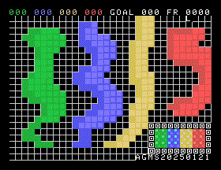

# The Nth Pong Wars Project

This started out as an exercise in learning how to program the
[NABU computer](https://en.wikipedia.org/wiki/NABU_Network)
(a circa 1982 design with a Z80 CPU at 3.5Mhz, a TMS9918A graphics chip, and
64K of RAM).  The code is also designed to work on other computers, starting
with Unix terminals using nCurses library, then maybe BeOS and Haiku OS.

The overarching problem is trying to fit the game into the limited frame update
time (currently aiming for 30 frames per second) and limited memory space (only
a few kilobytes free).  So for the NABU, there's a mix of C code and Z80
assember (mostly for the fixed point math).

## Compiling

If you want to compile it, see the top of the
[SourceCode/nabu/main.c](SourceCode/nabu/main.c) file for the command line to
use and how to compile the data files.

## License

The public version of the reputation system is licensed under the GNU General
Public License version 3.  The general idea is that if you improve the code, you
should contribute your changes back to the public.  See [LICENSE.md](LICENSE.md)
for details.

